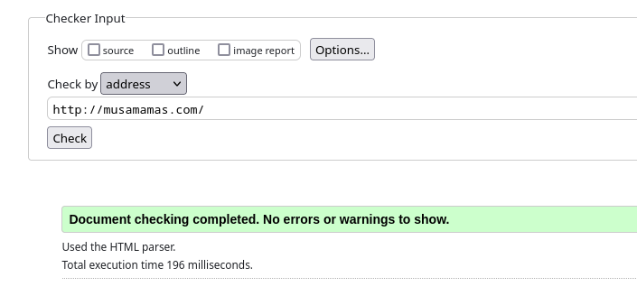

# Nimekäs

## a) 

Menin Namecheap sivuston, ja ostin täältä musamamas.com domainin. 

Lisäsin A record, joka liittyy ip-osoitteen. Mutta sivu ei toiminut. Sen jälkeen lisäsin vielä CNAME recordin, joka liittyy domainiin.

Unohdin uuden html ja sivun luomisen mainitsemaani. Eli poistin "/var/www/" ja "~/apache2/sites-available" kansioista vanhat sivut ja lisäsin uuden. Se lisäksi tarkistin tarkistin valittorin avulla.
Tähän hetkeen sivu toimii, mutta joskus tulee virheet toimimattomuudesta, en saanut selviä miksi. Varmasti domain tai palvelin ei toimii tasaisti.

## b)

Kuten ymmärsin, vain root-käyttäjältä oli käyttöoikeudet. Vaihtoin sen, eli ei ole enää tarvetta "sudo" käyttöön.

Tämä määrittää, että kun käyttäjä menee musamamas.com-osoitteeseen, palvelin näyttää kotisivut määritetystä hakemistosta.
Samalla AllowOverride All mahdollistaa .htaccess-tiedostojen käytön, jotta voit tehdä muutoksia ilman pääkäyttäjän oikeuksia.

## c)

Haluan nyt vaihtaa index.html, että minulla tulee mahdolisuutta lisätä 3 uutta kotisivuja.

Loin musa.html "/var/www/musamamas.com" kansiossa. Tiedosto näkyy validilta.

Samalla tavalla oli tehty mamas.html ja khan.html.

Ja sivut näkyy sellaisesti. On mahdolisuus päästä jonkun sivuun ja palata takaisin.

## d2)

DNS asetuksissa, lisäsin A record ja CNAME record molemmille alidomainille. 
Luulin sen hyödystä, että sama kuin pääsivun tilanteessa.

Tein uudet kansiot, mihin alidomainien konfiguraatiot lähtee. Siirsin html tiedostot uusiin kansioihin.

Loin uudet konfiguraatiot alidomainille. Olen määrännyt niiden pollut.

Päivitin apachen. 

Ei toiminut. 
En saanut selville miksi. Vaihtoin sitten Namecheap DNS asetuksissa, 
että "musa" alidomainilla vain A record ja "khan" alidomainilla on vain CNAME recordi.
Tarkistin konfiguraatiot ja "/var/www/musamamas.com" kansion, kaikki ihan ok minun mielestäni.
Luin ohjeet uudelleen joku mahdollisen asian ohittamista, mutta en saanut selville.

## e)

Olen asentanut uudet kommennot.

host komento näyttää verkkosivun ip-osoiteen.

dig-komento: Tämä on tehokkaampi ja yksityiskohtaisempi työkalu DNS-tietojen tutkimiseen. 
Se näyttää enemmän kenttiä kuin host, ja voit saada tietoja esimerkiksi DNS-palvelimista, IP-osoitteista ja TTL-arvoista.

HEADER-osio: opcode: QUERY: Tehty kysely on perus DNS-kysely.
status: NOERROR: Nimipalvelin palautti vastauksen ilman virheitä.
id: 59593: Kyselyn tunniste (identifier), joka yhdistää kyselyn ja vastauksen.

QUESTION SECTION: musamamas.com. IN A: Kysely koski domainia musamamas.com ja sen A-tietuetta, joka kertoo IPv4-osoitteen.

ANSWER SECTION: Kaksi A-tietuetta palautettiin:
94.237.36.197
192.64.119.226
Tämä tarkoittaa, että verkkosivulla on useita IPv4-osoitteita, mikä usein parantaa saatavuutta ja tasapainottaa verkkoliikennettä (load balancing).

Query time: 0 msec: Kyselyyn vastaaminen tapahtui nopeasti, koska nimipalvelin oli todennäköisesti lähellä tai välimuistissa.

SERVER: 94.237.127.9: Nimipalvelin, joka vastasi kyselyyn. IP-osoite viittaa UpCloudin nimipalvelimeen (Suomessa suosittu palveluntarjoaja).

WHEN: Mon Feb 24 03:03:29 UTC 2025: Kysely suoritettiin tällä aikaleimalla UTC-aikavyöhykkeen mukaisesti.

MSG SIZE rcvd: 74: Vastauksen koko tavuina (bytes).

QUESTION SECTION
musamamas.com. IN TXT: Kysely kohdistui domainin musamamas.com TXT-tietueisiin.

ANSWER SECTION
Ei vastausta (ANSWER: 0), mikä tarkoittaa, että domainille ei ole määritetty TXT-tietueita.

AUTHORITY SECTION
SOA dns1.registrar-servers.com. hostmaster.registrar-servers.com.:
Ensisijainen nimipalvelin on dns1.registrar-servers.com, joka kuuluu domain-rekisterinpitäjälle.
Ylläpitäjän sähköpostiosoite on hostmaster@registrar-servers.com (piste ennen domainia korvataan @-merkillä).

Vertailu:

Molemmat domainit palauttivat vastauksen ilman virheitä, mutta kummallakaan ei ole TXT-tietueita.

haaga.helia.fi käyttää organisaation omaa nimipalvelinta, kun taas musamamas.com käyttää ulkoista rekisterinpitäjän palvelinta.

haaga.helia.fi:n negatiivinen välimuistiaika (24 h) on pidempi kuin musamamas.com:n (1 h), mikä tarkoittaa, että jos tietuetta ei löydy, välimuistin tyhjennystä pitää odottaa pidempään ennen uutta kyselyä.

Vastausaika haaga.helia.fi:lle oli 0 ms, mikä viittaa välimuistiin, kun taas musamamas.com tarvitsi 20 ms, mahdollisesti koska kysely lähetettiin ulkoiselle palvelimelle.

## Lähteet
Namecheap: Host record setup. https://www.namecheap.com/support/knowledgebase/article.aspx/319/2237/how-can-i-set-up-an-a-address-record-for-my-domain/
Ask Ubuntu: What does "chmod +x " do and how do I use it? https://askubuntu.com/questions/443789/what-does-chmod-x-filename-do-and-how-do-i-use-it
Jenni Muhonen 2024: Nimekas(h5). https://github.com/jennimuhonen/linux-kurssi/blob/main/h5_nimekas.md
dig-komennon virallinen dokumentaatio: https://linux.die.net/man/1/dig
host-komennon man-sivu: https://linux.die.net/man/1/host
CloudFlare: What is a DNS TXT record? https://www.cloudflare.com/learning/dns/dns-records/dns-txt-record/
SPF/DNS/DMARC Records: https://stampedsupport.stamped.io/hc/en-us/articles/9521862912539-SPF-DNS-DMARC-Records 
